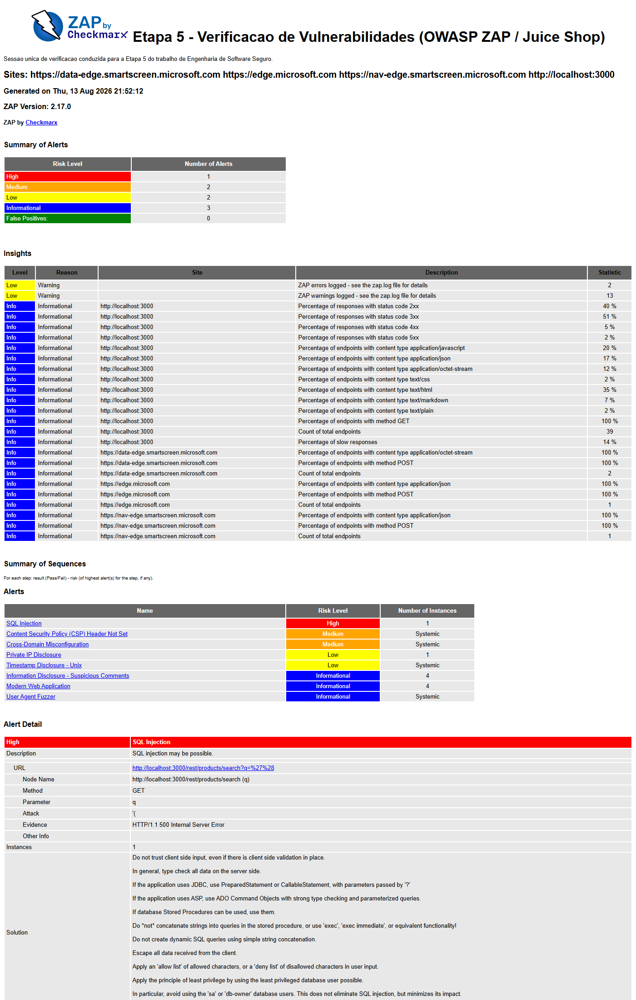
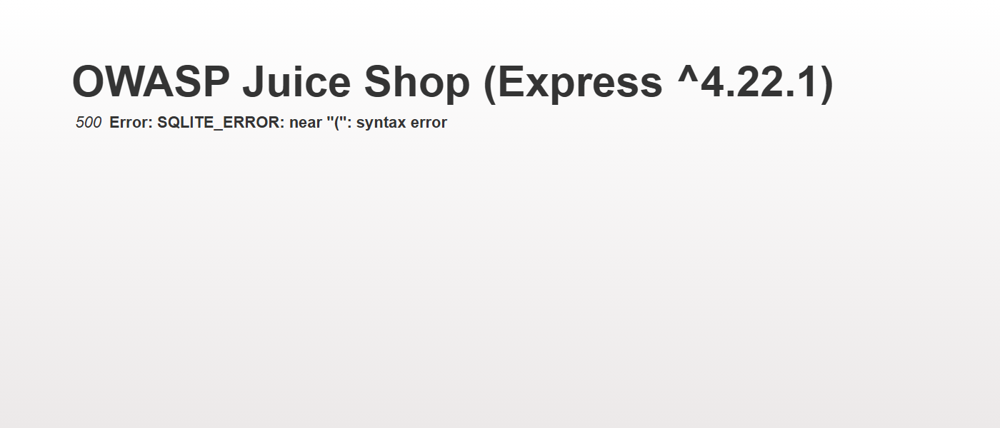

# Etapa 5 - Verificação de Vulnerabilidades

> **Sistema:** SIGH - Sistema Integrado de Gestão Hospitalar
> **Líder da etapa:** @PPrauchner
> É exigida **1 sessão de teste**. Como o SIGH não está implementado, a verificação é feita no **OWASP Juice Shop** com o **OWASP ZAP**. Evidências em `evidencias/etapa-5/capturas-de-tela/`.

| Item | Responsável | Situação |
| --- | --- | --- |
| Condução da sessão (setup Juice Shop + ZAP, captura de evidências) | @PPrauchner | Concluída (sessão executada em 13/08/2026; relatório e capturas versionados) |
| Análise dos 3 achados e correção proposta (com CWE/OWASP) | @mariasanchez0’s | Pendente (achados identificados e evidenciados na seção 2) |
| Revisão cruzada e complemento da tabela final | @lilydias24 e @lorenzoficher | Pendente |

---

## 1. Configuração da sessão

- **Alvo:** OWASP Juice Shop **20.2.0**, executado localmente em
  `http://localhost:3000`, a partir da distribuição oficial Node
  (`juice-shop-20.2.0_node24_win32_x64`), com integridade conferida pelo MD5
  publicado no release (`20d9213200cc4bfd25841531530a7272`). Aplicação
  deliberadamente vulnerável, criada para treinamento - é a hipótese expressamente
  autorizada pelo §23 do enunciado. **Nenhum sistema de terceiros foi tocado.**
- **Ferramenta e versão:** OWASP ZAP **2.17.0** (pacote *crossplatform*, executado
  sobre Java 25), em modo linha de comando com o **Automation Framework**. O plano
  usado está versionado em
  [`plano-automacao-zap.yaml`](../evidencias/etapa-5/plano-automacao-zap.yaml), para
  que a sessão possa ser repetida por qualquer integrante.
- **Tipo de varredura:** varredura completa em quatro fases encadeadas -
  *spider* tradicional (18 s), *AJAX spider* com Edge headless (34 s, 142 URLs, e é
  ele que alcança a interface Angular), varredura **passiva** sobre todo o tráfego
  capturado e varredura **ativa** (2 min 02 s), com teto de 2 minutos por regra.
  Foram mapeados **39 endpoints** do alvo.
- **Data da sessão:** 13 de agosto de 2026, relatório gerado às 21:52.
- **Escopo e limitações:**
  - O contexto `juice-shop` restringiu a varredura a `http://localhost:3000`;
    imagens, fontes, vídeo e `socket.io` foram excluídos por não acrescentarem
    superfície de análise.
  - O relatório lista quatro *sites*, mas **só `localhost:3000` tem alertas**. Os
    três domínios `*.microsoft.com` são telemetria do próprio Edge headless usado
    pelo AJAX spider, que passou pelo proxy do ZAP; por estarem fora do contexto,
    não foram varridos e aparecem com zero alertas. É ruído de instrumentação, não
    resultado.
  - A varredura foi feita **sem autenticação**: só a superfície acessível a um
    usuário anônimo foi coberta. As áreas que exigem login - e portanto boa parte
    das falhas de autorização, que são justamente o tema da trilha R06/RS03 - ficaram
    fora do alcance desta sessão.
  - O teto de 2 minutos por regra ativa limita as regras mais lentas (injeção cega
    baseada em tempo, por exemplo). O objetivo, conforme o §25, é **interpretar os
    resultados da ferramenta**, não esgotar a exploração.
  - Nenhum acesso indevido foi obtido e nenhum dado foi extraído. A única
    interação além da varredura automática foi a reprodução do achado V01 descrita
    abaixo, com a carga mínima necessária para separar verdadeiro de falso positivo.

### Resultado bruto da sessão

O ZAP registrou **8 tipos de alerta** sobre o alvo, assim distribuídos:

| Nível de risco (ZAP) | Nº de alertas |
| --- | --- |
| Alto | 1 |
| Médio | 2 |
| Baixo | 2 |
| Informativo | 3 |
| Falsos positivos marcados | 0 |

*Relatório do ZAP 2.17.0 gerado ao fim da sessão. O bloco "Summary of Alerts" traz a
contagem por nível de risco; a tabela "Alerts" lista os oito tipos encontrados; e o
"Alert Detail" mostra o achado de maior risco, com URL, parâmetro, carga usada e
evidência.*

O relatório completo está versionado em duas formas:
[HTML](../evidencias/etapa-5/relatorio-zap-juiceshop.html) para leitura e
[JSON](../evidencias/etapa-5/relatorio-zap-juiceshop.json) para conferência campo a
campo.

## 2. Achados

Os três achados levados à análise são os de maior risco atribuído pela ferramenta.
As colunas *Possível impacto* e *Correção proposta* são a análise da @mariasanchez0’s
(seção 3); as demais registram o que a sessão produziu.

| ID | Achado | Severidade (ZAP) | Evidência | Possível impacto | CWE/OWASP | Correção proposta |
| --- | --- | --- | --- | --- | --- | --- |
| V01 | **SQL Injection** em `GET /rest/products/search`, parâmetro `q`. Carga `'(` produz `HTTP 500` com `SQLITE_ERROR: near "(": syntax error` | Alto (confiança Baixa segundo o ZAP - **verificado como verdadeiro positivo**, ver abaixo) | [captura 03](../evidencias/etapa-5/capturas-de-tela/03-sqli-erro-sqlite.png); `pluginid` 40018 no [JSON](../evidencias/etapa-5/relatorio-zap-juiceshop.json) | | CWE-89; WASC-19 | |
| V02 | **Content Security Policy (CSP) Header Not Set** - 5 instâncias, incluindo a raiz da aplicação | Médio (confiança Alta) | [captura 02](../evidencias/etapa-5/capturas-de-tela/02-zap-relatorio-alertas.png); `pluginid` 10038 | | CWE-693; WASC-15 | |
| V03 | **Cross-Domain Misconfiguration** - resposta traz `Access-Control-Allow-Origin: *`, em 3 instâncias | Médio (confiança Média) | [captura 02](../evidencias/etapa-5/capturas-de-tela/02-zap-relatorio-alertas.png); `pluginid` 10098 | | CWE-264; WASC-14 | |

### Verificação do V01: verdadeiro positivo, não falso positivo

O ZAP marcou o SQL Injection com **confiança Baixa**, e o §26 do enunciado cobra
justamente a "capacidade de reconhecer limitações e possíveis falsos positivos". Por
isso o alerta foi verificado antes de entrar na tabela, com a carga mínima necessária:

- `?q=apple` (consulta normal) → `HTTP 200`
- `?q='` (aspas simples isolada) → `HTTP 200`, `{"status":"success","data":[]}` - o
  que **não** confirmaria nada sozinho
- `?q='(` (a carga do ZAP) → `HTTP 500`, e a resposta traz
  `Error: SQLITE_ERROR: near "(": syntax error`

A mensagem é do motor SQLite, não da aplicação: a entrada do usuário chegou ao
interpretador SQL sem escape e alterou a sintaxe da consulta. **O alerta é um
verdadeiro positivo.** Nenhum dado foi extraído - a confirmação parou no ponto em que
o erro de sintaxe prova a injeção, conforme o §25 ("não é necessário explorar
completamente as vulnerabilidades").

*Resposta ao payload `'(`. Além de confirmar a injeção, a página revela o framework e
a versão (`Express ^4.22.1`) - tratamento de erro que devolve detalhe interno ao
cliente é, por si, um segundo problema.*

### Alertas descartados desta análise

O §25 permite explicar por que os demais resultados foram descartados. Os cinco
alertas restantes não entraram entre os três analisados:

| Alerta | Risco | Por que foi descartado |
| --- | --- | --- |
| Private IP Disclosure (`192.168.99.100:3000`) | Baixo | Endereço interno devolvido por `/rest/admin/application-configuration`. É exposição real, mas de baixo alcance e, neste caso, um valor de configuração de exemplo do próprio Juice Shop, não da infraestrutura em que a sessão rodou |
| Timestamp Disclosure - Unix | Baixo | **Provável falso positivo.** O ZAP reconhece qualquer inteiro de 10 dígitos como *timestamp*; o valor sinalizado (`1666666667`) é uma constante do código, não um carimbo de tempo real |
| Information Disclosure - Suspicious Comments | Informativo | A "evidência" é a palavra `SELECT` dentro de `chunk-DAJ4olp_.js`, um bundle Angular minificado. Padrão textual, não vazamento |
| Modern Web Application | Informativo | Não é vulnerabilidade: o ZAP apenas registra que o alvo é uma SPA e que links podem depender de JavaScript |
| User Agent Fuzzer | Informativo | Resultado de teste, não achado: o ZAP variou o cabeçalho `User-Agent` e comparou respostas |

Vale registrar que **o ZAP não marcou nenhum alerta como falso positivo por conta
própria** (linha "False Positives: 0" do relatório) - a triagem acima é leitura do
grupo, não da ferramenta. É exatamente a diferença entre rodar a ferramenta e
interpretar o resultado.

## 3. Análise dos achados

> **Pendente - @mariasanchez0’s.** Os três achados estão identificados, evidenciados e
> com CWE atribuída pela ferramenta na seção 2. Falta, para cada um: o impacto
> possível, a relação com a categoria OWASP e a correção proposta - inclusive nas duas
> colunas em branco da tabela acima.
>
> Sugestão de ponto de partida, sem invadir a análise: V01 e V03 têm relação direta
> com riscos já registrados na [Etapa 2](E2_Riscos_e_NIST_CSF.md) - V01 com a
> validação de entrada ausente que aparece em R02, e V03 com a falta de fronteira de
> confiança entre serviços que sustenta R04.

### V01 - SQL Injection em `/rest/products/search`

- **O que foi encontrado:**
- **Por que é um problema:**
- **Correção proposta:**
- **Relação com CWE/OWASP:**

### V02 - Content Security Policy (CSP) Header Not Set

- **O que foi encontrado:**
- **Por que é um problema:**
- **Correção proposta:**
- **Relação com CWE/OWASP:**

### V03 - Cross-Domain Misconfiguration (`Access-Control-Allow-Origin: *`)

- **O que foi encontrado:**
- **Por que é um problema:**
- **Correção proposta:**
- **Relação com CWE/OWASP:**

## 4. Considerações da etapa

*(Pendente - o que a sessão mostrou, limitações da ferramenta e relação com os riscos
já registrados na [Etapa 2](E2_Riscos_e_NIST_CSF.md). Depende da análise da seção 3.)*
